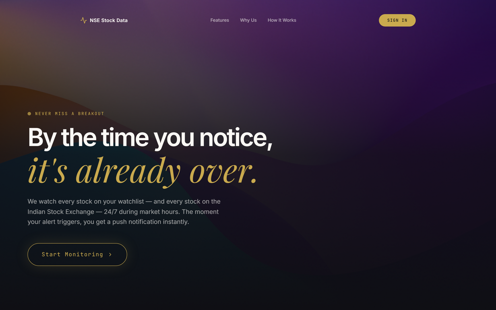
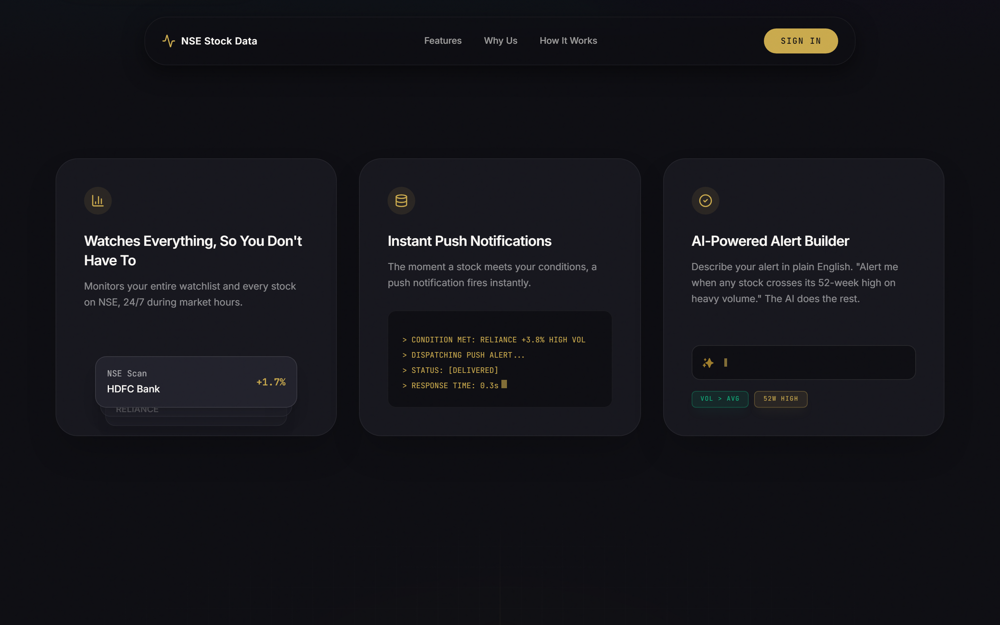
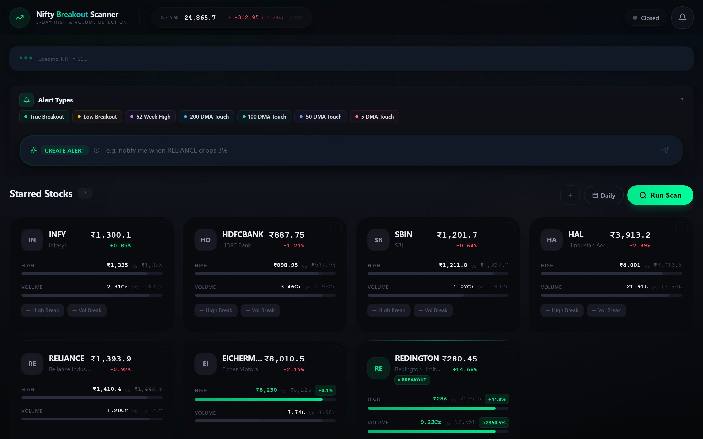
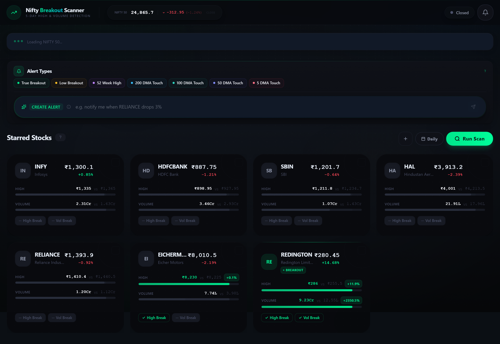

<div align="center">

# NSE Stock Scanner

**Real-time breakout detection for the National Stock Exchange of India.**

Monitor your watchlist and every Nifty 50 constituent — get instant alerts the moment a stock breaks out.

[](https://nextjs.org/)
[](https://www.typescriptlang.org/)
[](https://tailwindcss.com/)
[](https://vercel.com/)

</div>

---



## What It Does

NSE Stock Scanner watches stocks on the Indian National Stock Exchange in real-time during market hours (09:15–15:30 IST). When a stock shows unusual activity — a price breakout, a moving average touch, a new 52-week high — it fires an alert instantly via browser push notification and logs it to a persistent feed.

Built as a personal tool for daily market monitoring. One user, one dashboard, zero noise.

## Features

<table>
<tr>
<td width="50%">

### Breakout Detection
Scans for stocks where the day's high exceeds the 5-day max **and** volume surges past 3x the 5-day average. Partial breaks (high-only or volume-only) are flagged separately as "On Radar."

### 8 Alert Types
True Breakout · Low Breakout · 52-Week High · 200 DMA Touch · 100 DMA Touch · 50 DMA Touch · 5 DMA Touch · Scan — each color-coded in the alert feed with type-specific metrics.

### AI Alert Builder
Describe an alert in plain English — *"Notify me when RELIANCE crosses its 52-week high on heavy volume"* — and the system creates it. Powered by natural language processing via GitHub Issues.

</td>
<td width="50%">

### Live Ticker
Real-time price streaming for starred stocks during market hours. Updates every 10 seconds with price flash animations, breakout badges, and volume indicators.

### Nifty 50 Scanner
Full interactive table of all 50 constituents with sortable columns, breakout strength bars (H% / V%), and one-click watchlist additions. Auto-refreshes every 3 minutes during trading.

### Push Notifications
Browser notifications fire the instant an alert triggers, with a 5-minute cooldown per stock to prevent spam. Works alongside the persistent in-app alert feed.

</td>
</tr>
</table>

## Screenshots

<details>
<summary><strong>Landing Page</strong> — Cinematic hero with GSAP scroll animations</summary>




</details>

<details open>
<summary><strong>Dashboard</strong> — Watchlist cards, alert feed, scan controls</summary>



</details>

<details>
<summary><strong>Full Dashboard View</strong></summary>



</details>

## Tech Stack

| Layer | Technology |
|-------|-----------|
| Framework | Next.js 14 (App Router) + React 18 |
| Language | TypeScript (strict) |
| Styling | Tailwind CSS 3.4 + GSAP animations |
| Data Source | [`stock-nse-india`](https://www.npmjs.com/package/stock-nse-india) (NSE API wrapper) |
| Persistence | Upstash Redis (primary) + filesystem JSON (local fallback) |
| Validation | Zod |
| Auth | HMAC-SHA256 session cookies |
| Testing | Vitest + Testing Library |
| Deployment | Vercel (serverless) |

## Getting Started

### Prerequisites

- Node.js 18+
- npm

### Setup

```bash
# Clone the repository
git clone https://github.com/Zetta-tech/NSE-stock-data.git
cd NSE-stock-data

# Install dependencies
npm install

# Configure environment
cp .env.example .env
# Edit .env with your credentials (see Environment Variables below)

# Start the dev server
npm run dev
```

Open [http://localhost:3000](http://localhost:3000) and log in with your configured credentials.

### Environment Variables

| Variable | Required | Description |
|----------|----------|-------------|
| `AUTH_USERNAME` | Yes | Login username |
| `AUTH_PASSWORD` | Yes | Login password |
| `ADMIN_USERNAME` | Yes | Admin username (can bypass lockdown) |
| `ADMIN_PASSWORD` | Yes | Admin password |
| `AUTH_SECRET` | Yes | Session signing key — generate with `openssl rand -hex 32` |
| `UPSTASH_REDIS_REST_URL` | No | Upstash Redis URL (falls back to filesystem locally) |
| `UPSTASH_REDIS_REST_TOKEN` | No | Upstash Redis token |
| `GITHUB_TOKEN` | No | For AI alert builder (GitHub Issue creation) |
| `GITHUB_REPO` | No | Target repo for alert issues |

## Architecture

```
Browser
  → /login (POST /api/auth) → session cookie
  → /dashboard polls /api/state every N seconds
      ├── Alert feed (color-coded cards, unread badges)
      ├── Watchlist stock cards (price, volume, breakout strength)
      ├── Live ticker (10s updates during market hours)
      └── Nifty 50 table (sortable, auto-refresh)

POST /api/scan
  → scanMultipleStocks(watchlist)
      → per stock: historical data (15 days) + live intraday
      → analyzeBreakout() → ScanResult
      → MA checks (200/100/50/5 DMA), 52-week high check
      → if triggered: addAlert() → dedup → Redis/filesystem
      → addActivity() → audit trail (ring buffer, max 200)
  ← { results, alerts, scannedAt, marketOpen }
```

### Persistence

All stores follow the same pattern: **Redis primary → filesystem JSON fallback**.

| Redis Key | What It Stores |
|-----------|---------------|
| `nse:watchlist` | User's tracked stocks |
| `nse:alerts` | All fired alerts (deduped by symbol + type + date) |
| `nse:scanResults` | Latest scan results |
| `nse:activity` | Audit trail (ring buffer, max 200 events) |
| `nse:security` | Lockdown state + session epoch |

On Vercel, the filesystem is read-only — Redis is required in production.

### Market Hours

| Window (IST) | Behavior |
|-------------|----------|
| 09:15 – 15:30 | Live trading — real-time API calls |
| 09:00 – 16:00 | Extended — API calls allowed |
| Outside | Cached data served, API calls skipped |

### Alert Types

| Type | Trigger Condition |
|------|------------------|
| **True Breakout** | Day high > 5-day max high **and** volume ≥ 3x 5-day avg |
| **Low Breakout** | Day low < 10-day min low |
| **52-Week High** | Current high ≥ 52-week high |
| **200 DMA Touch** | Price within 3% of 200-day moving average |
| **100 DMA Touch** | Price within 3% of 100-day moving average |
| **50 DMA Touch** | Price within 3% of 50-day moving average |
| **5 DMA Touch** | Price within 3% of 5-day moving average |
| **Scan** | Generic watchlist scan result |

Alerts are **deduplicated** by `symbol + alertType + date`. When live data is unavailable during market hours (stale), breakout triggers are suppressed to prevent false positives.

## Deployment

The app deploys to **Vercel** on push to `main`:

1. Set environment variables in the Vercel dashboard
2. Ensure `UPSTASH_REDIS_REST_URL` and `UPSTASH_REDIS_REST_TOKEN` are configured (required in production)
3. Push to `main` — Vercel auto-builds and deploys

## Development

```bash
npm run dev          # Dev server (port 3000)
npm run typecheck    # Type check (must pass before PRs)
npm run lint         # ESLint
npm test             # Run test suite
npm run test:watch   # Watch mode
```

> **Note:** Use `npm run typecheck` to check for errors, not `npm run build` (which restarts the dev server).

---

<div align="center">
<sub>Built for daily market monitoring on the NSE.</sub>
</div>
